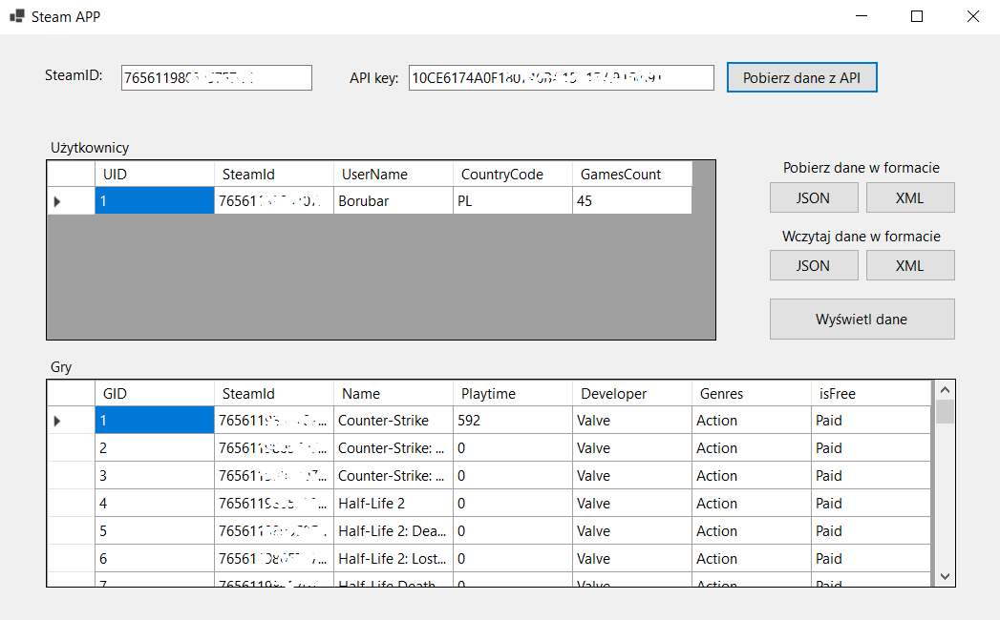
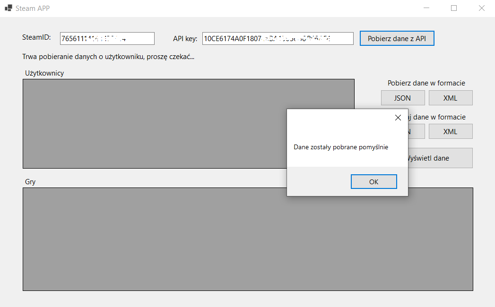
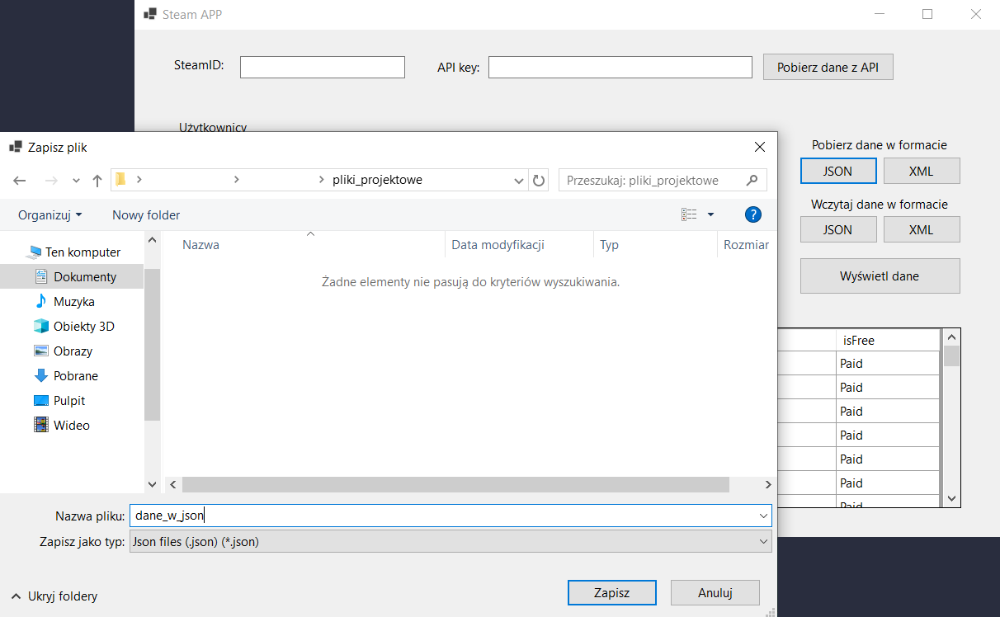
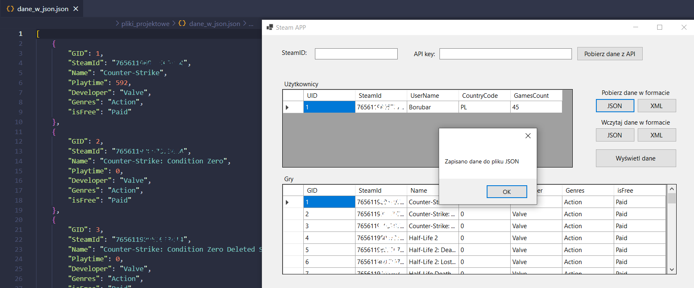
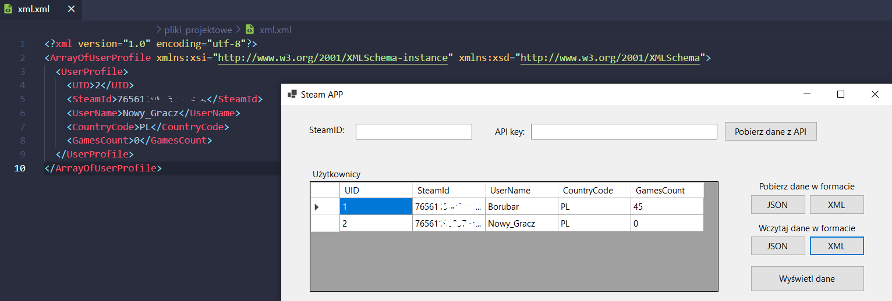
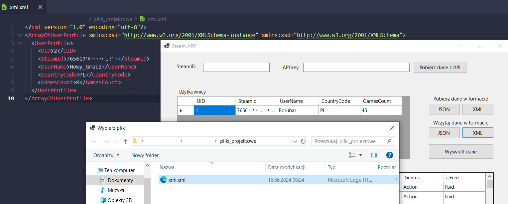

# General info
### Steam Rest API  
Application made for the credit of the course "Integration of Information Systems" in the 5th semester of studies. The purpose of the application is to retrieve user data from the Steam REST API. The application allows data to be written to database and XML and JSON file formats.

# Technologies
C# | MySQL

# Test environment setup details
 - Windows 10 22H2
 - Microsoft Visual Studio Community 2022 17.3.6 Community
 - .NET 6.0
 - XAMPP Control Panel v3.3.0 
 - phpMyAdmin v5.2.0

# Setup project
1. Clone repository.
2. It is recommended to run the application using for example Visual Studio. To launch the application click 'Run' Icon.  

# Functional Requirements
### Main functionalities of the application: 
* **Requests to Steam REST API:** The application, after entering the Steam ID and API Key, retrieves data about the user and the games he or she owns on the steam account.
* **Recording data in the database:** The application, after downloading the data, writes it to the MySQL database and allows you to read the data stored in the database.
* **Exporting data to JSON or XML format:** The application provides the ability to export data stored in the database to XML and JSON format.
* **Importing from JSON or XML format:** The application provides the ability to import data saved in XML and JSON formats into the database.

# Aplication preview
### Main screen of the application - loading user data from API

### Exporting data to JSON file format

### Importing data from XML file format

